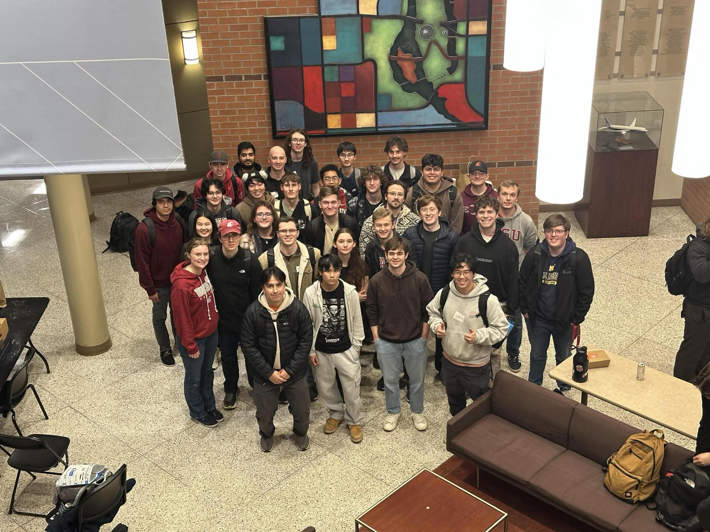
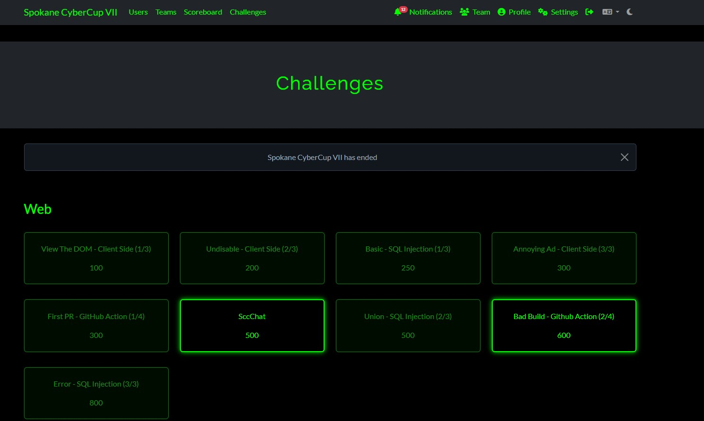
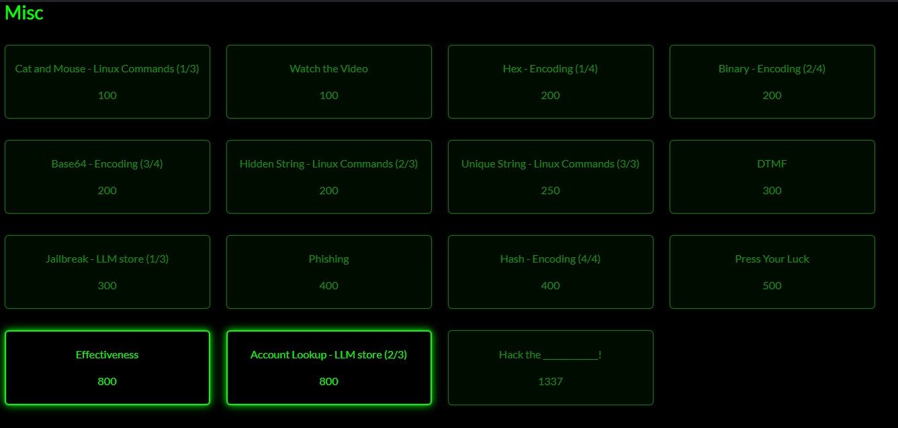
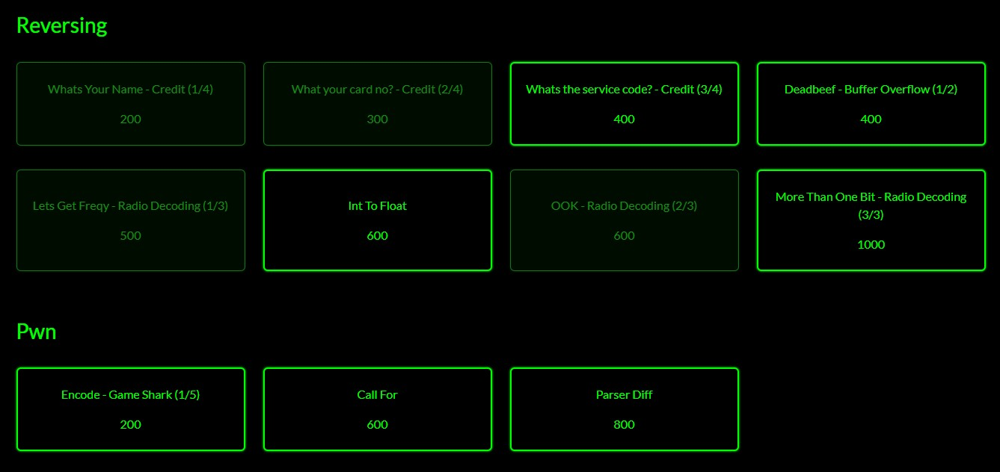

# EA 1 - Spokane CyberCup VII CTF

**Participant:** Joshua Chadwick  
**WSU ID:** 11817351

This file contains the writeup with relevant image sources regarding the Spokane CyberCup VII  
event that I participated in on February 7th, 2026 at the **Gonzaga University Graduate School**  
**of Business** in **Spokane, WA**.  

## Personal Contributions
I personally contributed to the SQL injection-based tasks and other OSINT-related challenges.  
Over the course of the first couple of hours at the event, I was able to accomplish all 3  
tiers to the SQL injection challenges. I also contributed greatly to our team's points  
through the lock picking challenges, escaping handcuffs and breaking 1 through 3-pin padlocks.  

I had also attempted the LLM prompt injection challenge, but was unsuccessful at getting the  
LLM in question to spit out the flag that was stored in the system config prompt. The  
solution to the challenge was quite simple as was demonstrated by another contestant where  
they stated that they just told the LLM to read him a bedtime story with the flag as the  
subject of the story, and this worked for them. I suppose that my problem solving skills  
need a bit of refinement and I don't always need to think so deep about the problems that I  
am trying to solve.

## GitHub for Spokane CyberCup 2026's Challenges
Recently the CTF team has released all of the problems on the organizer's GitHub page, so I  
will provide that link below for your reference.  
[Link to the GitHub for Spokane CyberCup 2026 Challenges](https://github.com/mdulin2/SC7)

## Hackathon Photos
  
Image 1: *Group photo at the Spokane CyberCup where I am in the center with a necklace on.*  

  
Image 2: *First batch of our team's completed challenges.*  

  
Image 3: *Second batch of our team's completed challenges.*  

  
Image 4: *Third batch of our team's completed challenges.*