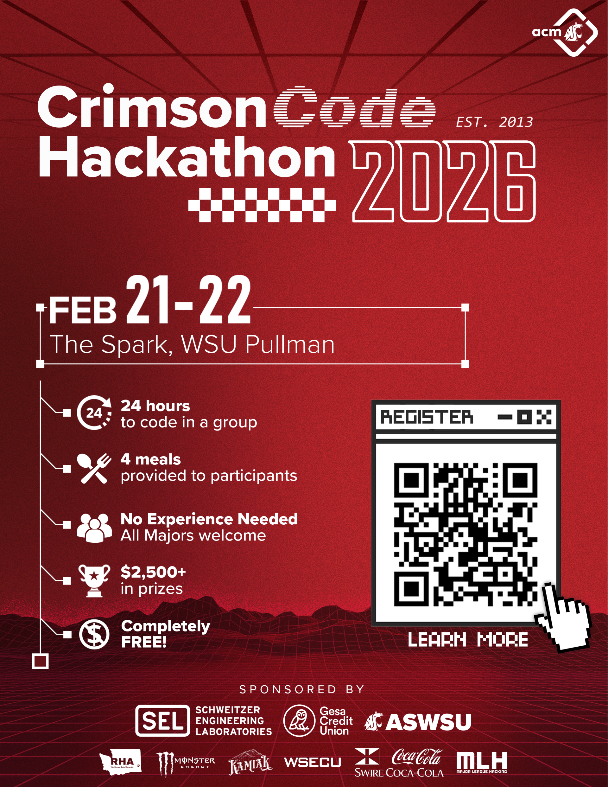

# CrimsonCode 2026 Organizer Contribution

## Event Information

Date hosted: February 21st-22nd, 2026
Location: Spark Academic Innovation Hub, Pullman, WA
Number of registrants: ~290
Number of checked-in participants: ~200

## Introduction

For the CrimsonCode 2026 event here at the WSU campus, I had the privilage  
to be an organizer for the event. This was the 2nd time that I had organized  
a CrimsonCode hackathon for the university, and it was a resounding success.  

I got to personally facilitate correspondance between the Association for  
Computing Machinery (ACM) board and Schweitzer Engineering Labs (SEL) as  
our premiere sponsor for the event. SEL has been the premiere sponsor for  
CrimsonCode for a large number of years and also contributed over 10  
volunteers, most of whom were from the Government Services Department  
which is also my department. I was able to advertise the event to my  
department which informed people that the event was soon to take place,  
which roused a number of volunteers to action as they assisted students  
with resolving technical issues, planning their projects, learning about  
new and innovative resources to accomplish their goals (i.e. GitHub Copilot),  
and so much more.  

You can check out the post I made about my time at CrimsonCode as an organizer  
at this link: [Joshua Chadwick LinkedIn Post for CrimsonCode 2026](https://www.linkedin.com/posts/joshuadchadwick_i-am-proud-to-share-that-i-have-helped-bring-activity-7433422195454046208-MMbC?utm_source=share&utm_medium=member_desktop&rcm=ACoAADNwEusBEHxbxniHS5UmmxVhRY7wxtS5-Rg)

## Industry Involvement in CrimsonCode

The event was so much fun and we had a wide variety of industry involvement in  
this year's event which gave students a fun, new incentive to perform well and  
put hard work into their projects. The following companies were represented at  
CrimsonCode either through sponsoring our event, contributing employees for  
student mentorship, contributing employees for judging projects, or multiple of  
those options:
* Schweitzer Engineering Labs
* Gesa Credit Union
* Apple Inc.
* Microsoft
* Amazon
* Amazon Web Services
* Whatnot
* Meta
* Monster Energy
* Kamiak Coffee Company
* Major League Hacking (and affiliated partners/sponsors)
* Swire Coca-Cola
* ASWSU
* WSECU
* WSU RHA

## CrimsonCode 2026 Poster

